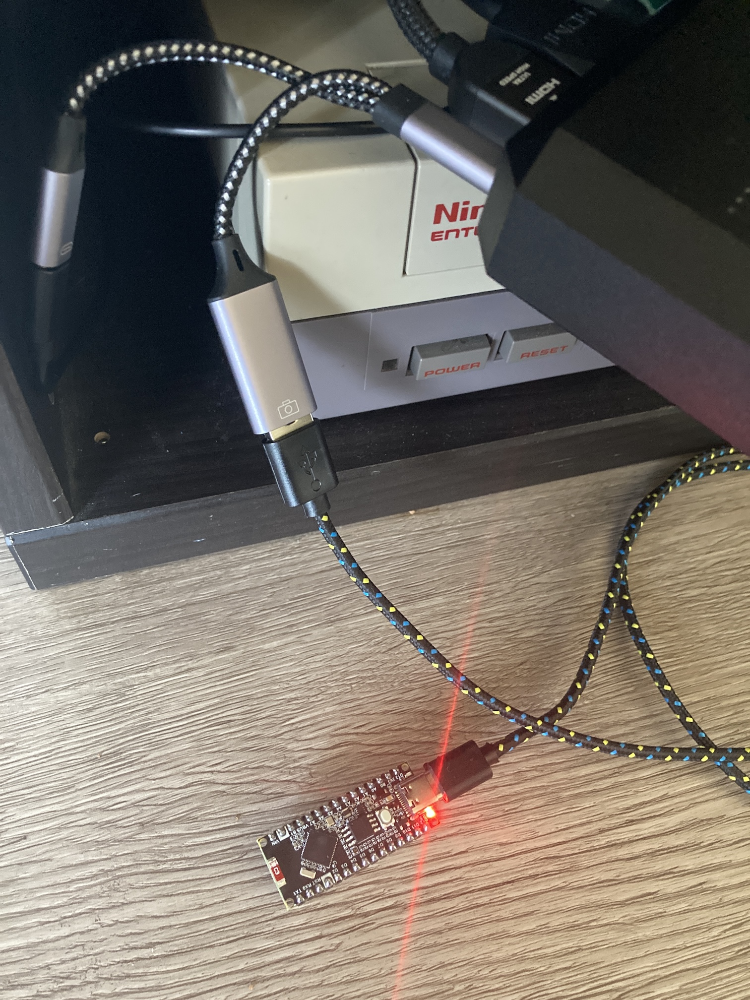
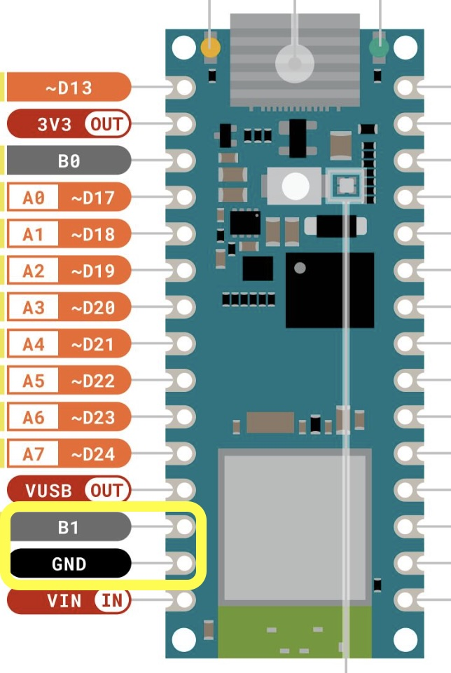

# ClownCar
Clown Car is an Arduino Nano ESP32 + OTG adapter that changes profiles for the RT4K based on gameID. <br />

<br />


See it in action: https://youtu.be/ldbfFbKzjh8
<br /><br />
## Updates
  - New Web UI!
    - [Follow steps below to setup.](https://github.com/svirant/ClownCar/#additional-steps-for-latest-version-of-clowncarino)
  - Detection rates have been sped up!
    - Unpowered consoles that are DNS address based, timeout after 7 seconds. This is reduced to 2 seconds after a console's first power up.
      - console DNS addresses will be automatically replaced by IP in order for the 2 second timeout to work.
    - Quickest if IP address is used versus Domain address.
      - Ex: http://10.0.1.10/gameid vs http://ps1digital.local/gameid 

## Parts used
  - **OTG Adapter:** https://www.amazon.com/dp/B0CQKXWRNF
     - 18w version, not 60w
     - not all OTG adapters work, this one works the best
  - **Arduino Nano ESP32:** https://www.amazon.com/dp/B0CXHZXJXP
 <br /><br />

## gameID devices currently supported
| **Device**    | Supported | Notes |
| ------------- | ------------- |------------- |
|PS1Digital | yes, confirmed first hand | |
|N64Digital | yes, confirmed first hand | |
|RetroGEM N64 | yes | |
|RetroGEM PS1 | yes | |
| MemCardPro 2 | yes, for GameCube, PS1, & PS2 | |
| Fenrir ?| | |
| more on the way... |  

### LED activity
| **Color**    | Blinking | On | Notes |
| ------------- | ------------- |------------- |------------- |
|<code style="color : blue">BLUE</code> | WiFi active, querying gameID addresses| Longer blinks represent an unsuccessful query of gameID address. Usually a powered off console in the list.| After initial power, no blue light means WiFi not found. |
|<code style="color : green">GREEN</code> | 1 second blink is gameID match found and SVS profile being sent to RT4K | |  | 
|<code style="color : red">RED</code> | | Power| No way to control as it's hardwired in. May just need to cover with tape. |

You can disable the <code style="color : blue">BLUE</code> / <code style="color : green">GREEN</code> LEDs by commenting out the following lines in the .ino:
```
 //pinMode(LED_GREEN, OUTPUT);
 //pinMode(LED_BLUE, OUTPUT);
```
## Programming the Arduino Nano ESP32
I recommend the [Official Arduino IDE and guide](https://www.arduino.cc/en/Guide) if you're unfamiliar with Arduinos. All .ino files used for programming are listed above. The following Libraries will also need to be added in order to Compile successfully.<br />
- **Libraries:**
  - If a Library is missing, it's usually available through the built-in Library Manager under "Tools" -> "Manage Libraries..."
  - <EspUsbHostSerial_FTDI.h>  Follow these steps to add EspUsbHostSerial_FTDI.h
    - Goto https://github.com/wakwak-koba/EspUsbHost
    - Click the <code style="color : green">GREEN</code> "<> Code" box and "Download ZIP"
    - In Arudino IDE; goto "Sketch" -> "Include Library" -> "Add .ZIP Library"
   

**To put the Nano ESP32 into programming mode** 
 - Double-click the button on top right after connecting the usb-c cable. (or triple-click w/o disconnecting)
 - You will see the <code style="color : green">GREEN</code> led strobe if successful.
 - TLDR is: Because ClownCar takes over the usb port, this resets that.

## Additional steps for latest version of ClownCar.ino
Requires you to short the B1 and Gnd pins during one of the steps. This method is the best I got at the moment.

1. "double click" the physical RST button right after connecting to your PC/Mac to put into "bootloader mode". You'll see the green led strobe if successful.
2. Open up the ClownCar.ino in the Arduino IDE
3. In Arduino IDE, under the "Tools" menu, make sure..
- Board - "Arduino Nano ESP32" selected
- Port - The listed "Serial" port is chosen, not dfu one.
- Partition Scheme - "With SPIFFS partition (advanced)" is chosen
- Pin Numbering - "By Arduino pin (default)"
- USB Mode - "Normal mode (TinyUSB)"
- Programmer  - "Esptool" is selected
4. Select the last option in "Tools" menu. "Burn Bootloader"
5. THIS WILL FAIL the first time. Wait about 15 seconds and then go back and select the new "Serial" port that is available and select "Burn Bootloader" again. 
6. This should successfully burn the bootloader and now your board will have a half red/blue led that is lit.
7. Disconnect the usb cable and short the B1 pin with the Gnd pin next to it. I used some metal tweezers.


8. With B1 and Gnd shorted, reconnect the usb cable and the led should now be a solid Green.
9. Return to the Arduino IDE and select "Sketch", "Upload Using Programmer". Make sure to use THIS option and NOT the normal "Upload" option.
10. If successful, the sketch will compile and upload leaving you with a message "Hard resetting via RTS pin..."
11. Disconnect the usb cable and remove the short on B1 and Gnd.
12. Upon reconnecting the usb cable your board should **Successfully boot ClownCar**. You should see the blue led return indicating it's connected to WiFi and looking for addresses to connect to. If the blue led does not return, press the RST button and/or make sure you have your WiFi settings correctly entered. Remember, only 2.4GHz wifi is supported.
13. For all future changes/uploads...
- The board will always need to be in "bootloader" mode by "double clicking" the RST button right after connecting the usb cable. 
- You can also now return to using the normal "Sketch" -> "Upload" option.

## General Setup

For consoles list, quickest if IP address is used versus Domain address:
  - Ex: http://10.0.1.10/gameid vs http://ps1digital.local/gameid 

<br />
If you have multiple gameID consoles on when the ClownCar is booting, the console furthest down the "consoles" list wins. After that it keeps track of the order.

There are a multiple moving parts with this setup, and if you have issues, please use the "ClownCar_usb-only-test.ino". More info in the troublehshooting section at the end.

#### I believe the only library you need to add is a fork of "EspUsbHost"
Go to: https://github.com/wakwak-koba/EspUsbHost 
 - Click the GREEN "<> Code" box and "Download ZIP"
 - In the Arudino IDE; goto "Sketch" -> "Include Library" -> "Add .ZIP Library"

<br />

## Adding gameIDs, Consoles, and other Options

The new Web UI allows you to live update the Consoles and gameID table. You no longer have to reflash for changes. You can also now import and export your config if anything were to happen and you need to rebuild.


/*
////////////////////
//    OPTIONS    //
//////////////////
*/

bool const VGASerial = false;    // Use onboard TX1 pin to send Serial Commands to RT4K.

bool const S0_pwr = true;        // When all consoles defined below are off, S0_<whatever>.rt4 profile will load

bool const S0_gameID = true;     // When a gameID match is not found for a powered on console, DefaultProf for that console will load
```
## WiFi setup
WiFi is listed just below. **ONLY** compatible with **2.4GHz** WiFi APs. Replace SSID and password with your network's. Make sure to not leave out the "" "" quotes.
```
WiFi.begin("SSID","password");
```
<br />

## Thank you!
 - Thanks to https://github.com/wakwak-koba for his fork of the EspUsbHost library. Without it, it would have taken much longer to figure out the usb communication bits.
  - Huge thanks to @CielFricker249 / "Aru" on the RetroTink discord for the idea and testing of the Donut Dongle project as well!

## TroubleShooting ##

If only the red status and power led are red, and you can ping the device but not access the web ui, the SPIFFS partition has not been configured. Make sure to follow the steps above to ensure the bootloader has been burned and device flashed properly the first time.

The <code style="color : green">GREEN</code> and <code style="color : blue">BLUE</code> leds indicate WiFi and usb serial/gameID lookup respectively. This should help diagnose as a first step.

After that, confirm the following:
 - Configured Wifi settings in .ino.
    - Make sure it's to a **2.4GHz** Wifi AP. **5GHz is NOT supported** by the Arduino Nano ESP32.
 - Have at least 1 gameID to profile in the gameDB
 - Have at least 1 address in the consoles db that you can access with a web browser

 If you are sure of these settings, and it still does not work, try the following to test the usb serial connection:
  - Configure your Arduino Nano ESP32 with the provided "ClownCar_usb-only-test.ino". This is configured to only load "remote profile 8".
    - You can change the 8 to 1 - 9 if needed.
  - Verify that everything is connected with your OTG adapter and has power.
  - Press the reset button on top of the Arduino and within a couple of seconds it should load the remote profile.

    If this works, then there must be a wifi connectivity issue somewhere. 

    Here is a video of the "usb only test" being performed: https://www.youtube.com/watch?v=XP7OSW7X0DQ

