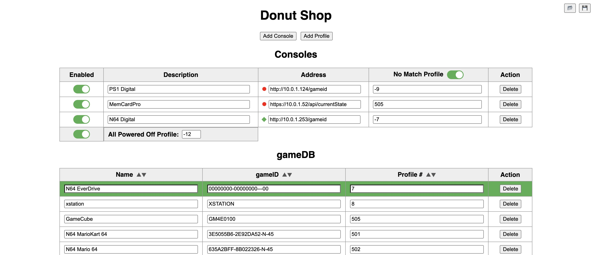

# DonutShop
is an Arduino Nano ESP32 + OTG adapter that changes profiles for the RT4K based on gameID. <br />

<br />

<p align="center"></p><br />


See it in action: https://youtu.be/ldbfFbKzjh8
<br /><br />
## Updates
  - New flash / setup method can now all be done via web browser.
  - ALL settings are now configured in the Web UI.
  - New Captive Portal for joining to your home network.
  - New Settings page allows you to Update Firmware and Load S0 profile if all Consoles are off. 
  - OTA updates now available. "donutshop" shows up as a Network port in Arduino IDE 2.x
  - New Web UI!
  - Detection rates have been sped up!
    - Unpowered consoles that are DNS address based, timeout after 7 seconds. This is reduced to 2 seconds after a console's first power up.
      - console DNS addresses will be automatically replaced by IP in order for the 2 second timeout to work.
    - Quickest if IP address is used versus Domain address.
      - Ex: http://10.0.1.10/gameid vs http://ps1digital.local/gameid 

## Parts used
  - **OTG Adapter:** https://www.amazon.com/dp/B0CQKXWRNF
     - 18w version, not 60w
     - not all OTG adapters work, this one works the best
  - **Arduino Nano ESP32:** https://www.amazon.com/dp/B0CXHZXJXP
 <br /><br />

## gameID devices currently supported
| **Device**    | Supported | Notes |
| ------------- | ------------- |------------- |
|PS1Digital | yes, confirmed first hand | |
|N64Digital | yes, confirmed first hand | |
|RetroGEM N64 | yes | |
|RetroGEM PS1 | yes | |
| MemCardPro 2 | yes, for GameCube, PS1, & PS2 | MemCardPro 2.0+ firmware requires https instead of http |
| Fenrir ?| | |
| more on the way... |  

### LED activity
| **Color**    | Blinking | On | Notes |
| ------------- | ------------- |------------- |------------- |
| 🟠| | Wifi not connected | After 2 minutes of unsuccessfully connecting, "DonutShop_Setup" Wifi AP will reappear to help with reconnection. |
| 🔵| WiFi active, querying gameID addresses| Longer blinks represent an unsuccessful query of gameID address. Usually a powered off console in the list.| After initial power, no BLUE light means WiFi not found. |
| 🟢| 1 second blink is gameID match found and SVS profile being sent to RT4K | |  | 
| 🔴| | Power| No way to control as it's hardwired in. May just need to cover with tape. |

## Flashing 
1. Download the latest ```.bin``` files listed above
2. Open [ESP Tool](https://espressif.github.io/esptool-js/) in Chrome, Brave, or Edge
3. Connect your Arduino Nano ESP32 via USB and double click the RST button immediately following to enter **recovery mode** (a GREEN led will strobe when successful)
4. Click **Connect** and select your device (typically starts with USB JTAG)
   - You may first need to connect to "Nano ESP32" and refresh the page for "USB JTAG" to appear in the Connect menu. 
5. Click **Erase Flash** to format your device (required for LittleFS)
6. Set Flash Address to **0x0** and Choose the downloaded file ```Donut_Shop_Full.bin```
7. Click **Add File**, set the next Flash Address to **0xF70000**, Choose ```nora_recovery.bin```
8. Click **Program**
9. Once complete, reconnect the USB cable of the device and continue **Setup** below...

## Setup
1. Upon reconnecting the USB cable, your board should **Successfully boot DonutShop** and leave you with an ORANGE led.
2. With your computer or smartphone, join the broadcasted ```DonutShop_Setup``` WiFi to connect it to your home network.
3. Follow the instructions listed and once complete, you should see a BLUE led indicating it's connected to WiFi and looking for addresses to connect to. If the BLUE led does not show, press the RST button one time.
4. You should now be able to visit http://donutshop.local to add Consoles and gameIDs.
5. For all future changes/uploads you can use the "Firmware Update" section in Settings to apply the latest listed _Update .bin file. Updating with the _Full version will not work.
   
## General Setup

For Consoles, quickest if IP address is used versus Domain address:
  - Ex: http://10.0.1.10/gameid vs http://ps1digital.local/gameid 

If you have multiple consoles on when DonutShop is booting, the console furthest down the list wins. If more than 2 consoles are active when one is powered off, the console that was on prior takes over. (Order is remembered.)<br>

There are a multiple moving parts with this setup, and if you have issues, please use the "Donut_Shop_usb-only-test.ino". More info in the troublehshooting section at the end.

## Adding gameIDs, Consoles, and other Options

The Web UI allows you to live update the Consoles and gameID table. You no longer have to reflash for changes. You can also now import and export your config if anything were to happen and you need to rebuild.

## WiFi setup
**ONLY** compatible with **2.4GHz** WiFi APs. Configured during initial setup process. If you need to change SSID or password, the "DonutShop_Setup" AP will reappear after 2 minutes of not being able to connect.

## [Advanced] Programming the Arduino Nano ESP32 with custom .ino changes
I recommend the [Official Arduino IDE and guide](https://docs.arduino.cc/software/ide-v2/tutorials/getting-started-ide-v2/) if you're unfamiliar with Arduinos. All .ino files used for programming are listed above. The following Libraries will also need to be added in order to Compile successfully.<br />
- **Libraries:**
  - If a Library is missing, it should be available through the built-in Library Manager under "Tools" -> "Manage Libraries..."
  - <EspUsbHostSerial_FTDI.h>  Follow these steps to add EspUsbHostSerial_FTDI.h
    - Goto https://github.com/wakwak-koba/EspUsbHost
    - Click the <code style="color : green">GREEN</code> "<> Code" box and "Download ZIP"
    - In Arudino IDE; goto "Sketch" -> "Include Library" -> "Add .ZIP Library"
1. First, you must have completed the steps shown in the "Flashing" section above at least once before continuing.
2. "Double click" the RST button right after connecting to your PC/Mac to put into "recovery mode". You'll see a GREEN led strobe if successful.
3. Open up Donut_Shop.ino in the Arduino IDE to make your custom changes.
4. Under the "Tools" menu, make sure...
- Board - "Arduino Nano ESP32" is selected
- Port - The listed "Serial" port is chosen, not dfu one.
    - If Donut_Shop is currently running, you should also see a "DonutShop" Network Port that connects via WiFi.
- Partition Scheme - "With SPIFFS partition (advanced)" is chosen
- Pin Numbering - "By Arduino pin (default)"
- USB Mode - "Normal mode (TinyUSB)"
5. To flash the changes, select "Sketch" -> "Upload"

<br />

## Thank you!
 - Thanks to https://github.com/wakwak-koba for his fork of the EspUsbHost library. Without it, it would have taken much longer to figure out the usb communication bits.
  - Huge thanks to @CielFricker249 / "Aru" on the RetroTink discord for the idea and testing of the Donut Dongle project as well!

## TroubleShooting ##

The 🔵 and 🟢 leds indicate WiFi and usb serial/gameID lookup. This should help diagnose as a first step.

If you are sure of these settings, and it still does not work, try the following to test the usb serial connection:
  - Configure your Arduino Nano ESP32 with the provided "Donut_Shop_usb-only-test.ino". This is configured to only load "remote profile 8".
    - You can change the 8 to 1 - 9 if needed.
  - Verify that everything is connected with your OTG adapter and has power.
  - Press the reset button on top of the device and within a couple of seconds it should load the remote profile.

    If this works, then there must be a wifi connectivity issue somewhere. 

    Here is a video of the "usb only test" being performed: https://www.youtube.com/watch?v=XP7OSW7X0DQ

