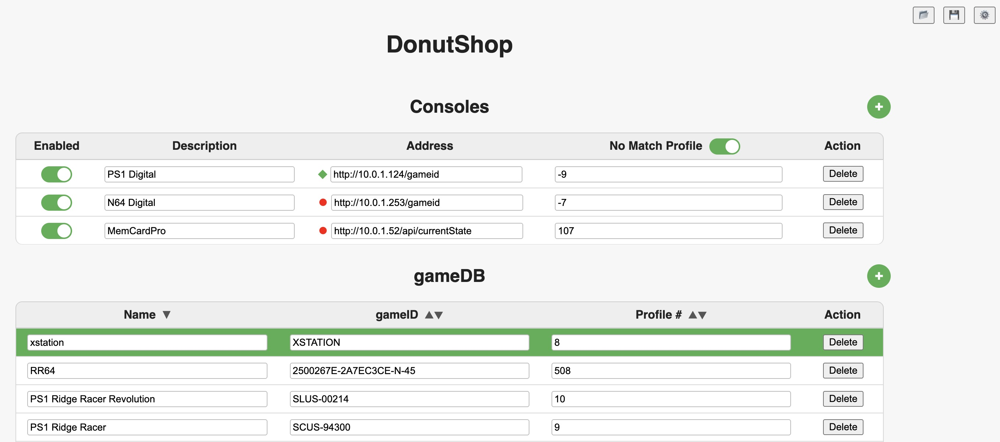
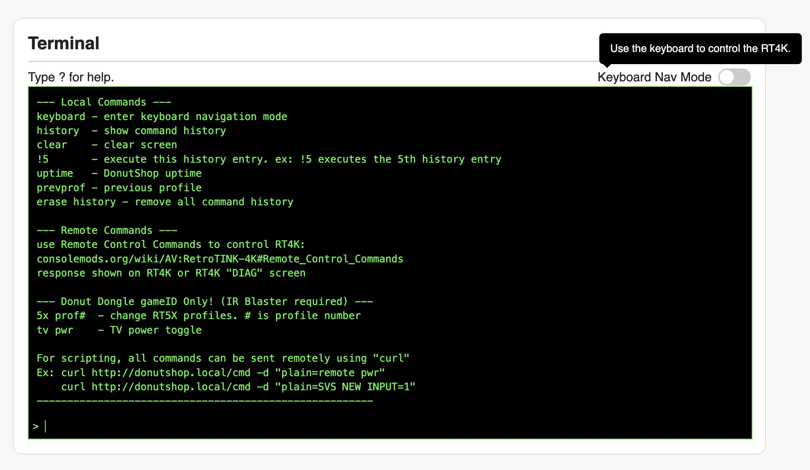
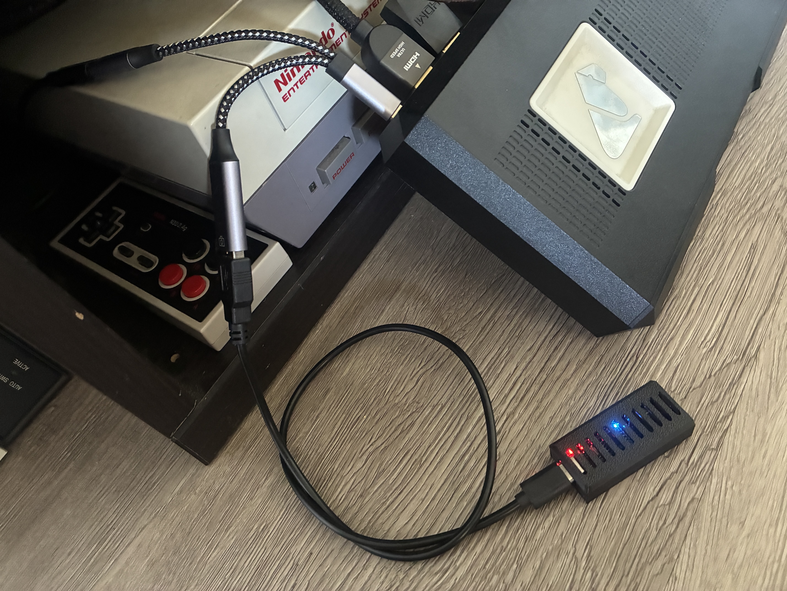
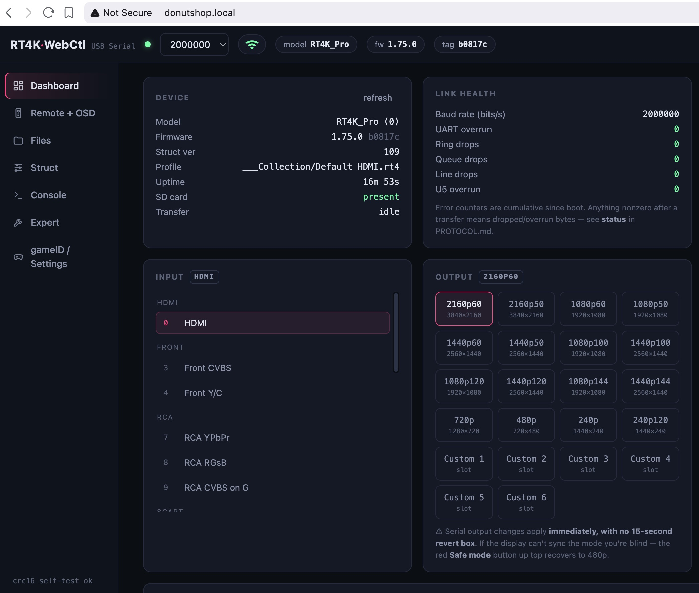
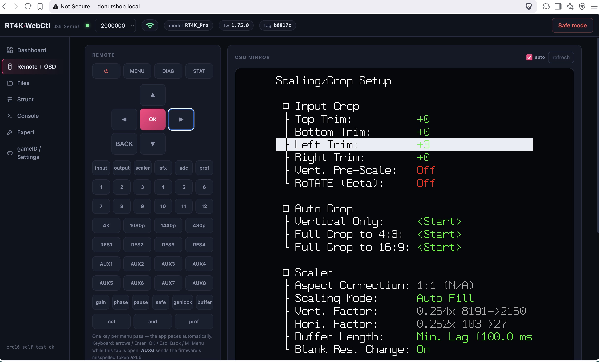
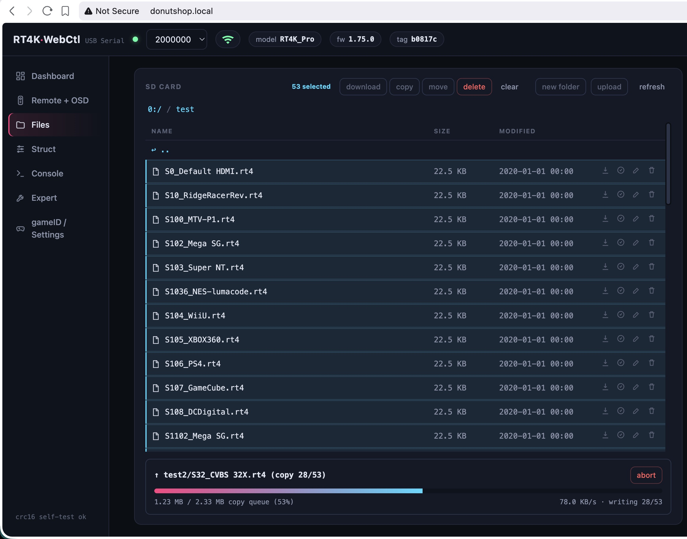
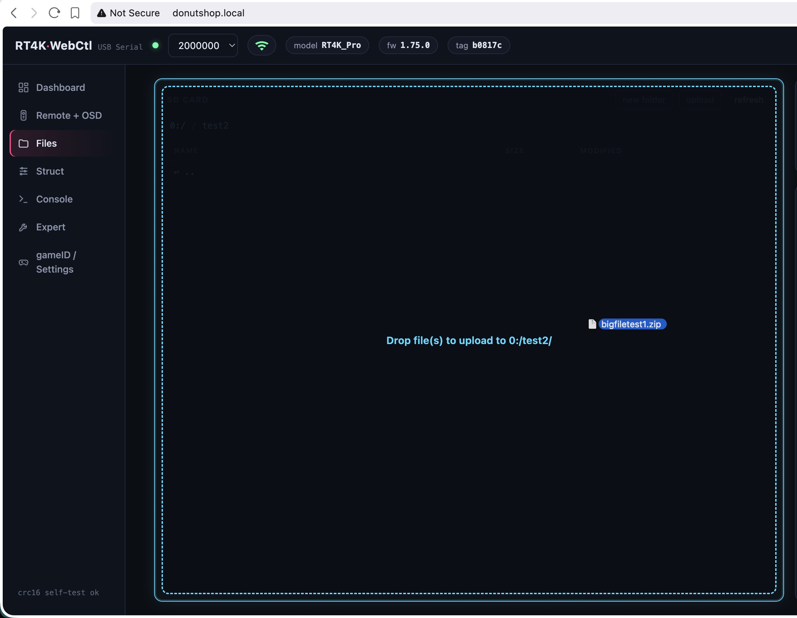
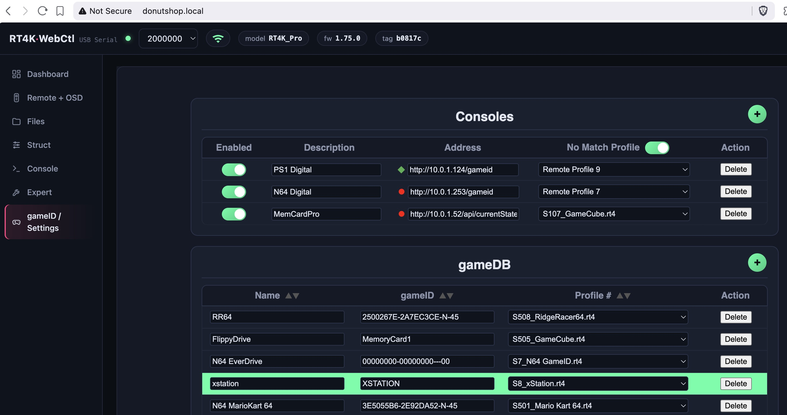
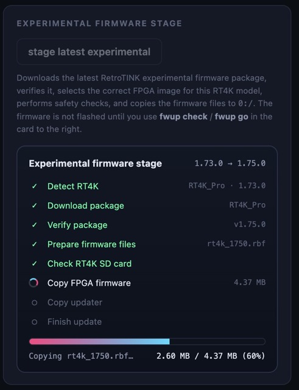

# DonutShop
is an Arduino Nano ESP32 + OTG adapter that changes profiles for the RetroTink 4K based on gameID. <br />

<p align="center"><br />
<p align="center"><br />

<p align="center"></p><br />

See it in action: https://youtu.be/ldbfFbKzjh8 <br>

  - Note: In version v0.7.0 you can still access this gameID only version at http://donutshop.local/gameid
    
<br /><br />
## DonutShop ft. RT4K WebCtl (work in progress v0.7.0)
 - Requires RT4K v1.75+ fw
 - This version integrates the gameID functionality into the RT4K WebCtl internal test app. It's still very much a work in progress, but I wanted to share the experience thus far.
 - In a nutshell, with WebCtl on DonutShop, you gain:
    - Dashboard of RT4K status, ability to change Input/Output
    - Remote + OSD
    - File Manager with bulk file operations including, copy/move/delete/download,drag & drop uploads.
    - SVS Simulator (for example - load SVS profiles by #), load/download ANY profile on the SD Card
    - Stage latest experimental firmware over Wi-Fi directly from Github
<br>
<p align="center"><br />
<p align="center"><br />
<p align="center"><br />
<p align="center"><br />
<p align="center"><br />
<p align="center"><br /></p><br>

## Updates
  - WiP DonutShop ft. RT4K WebCtl now available to experience the new features of the RT4K v1.75+ firmware
  - .3mf added for printing a case.
  - NEW Terminal to relay [Remote Control Commands](https://consolemods.org/wiki/AV:RetroTINK-4K#Remote_Control_Commands). Toggle **Keyboard Nav Mode** to navigate the RT4K interface with keyboard keys.
  - New flash / setup method can now all be done via web browser.
  - ALL settings are now configured in the Web UI.
  - New Captive Portal for joining to your home network.
  - New Settings page allows you to Update Firmware and Load S0 profile if all Consoles are off. 
  - OTA updates now available. "donutshop" shows up as a Network port in Arduino IDE 2.x
  - New Web UI!
  - Detection rates have been sped up!
    - Unpowered consoles that are DNS address based, timeout after 7 seconds. This is reduced to 2 seconds after a console's first power up.
      - console DNS addresses will be automatically replaced by IP in order for the 2 second timeout to work.
    - Quickest if IP address is used versus Domain address.
      - Ex: http://10.0.1.10/gameid vs http://ps1digital.local/gameid 

## Parts used
(affiliate links, support [RetroRGB!](https://retrorgb.com/))
  - **OTG Adapter:** The following were tested on 4/27/2026. Not all OTG adapters work.
     - [Jadebones USB C to USB OTG](https://amzn.to/4cRdskT)
     - [USB C OTG Adapter, 2 in 1 USB-C to USB](https://a.co/d/07DvAKlc)
     - IT: [IVIVTOR USB-C OTG Cable Adapter](https://www.amazon.it/dp/B0F8N12YQD) (tested on 8/24/26)
  - **Nano ESP32:** pick one based on availability
     - [WaveShare Nano ESP32](https://amzn.to/45FE30D) or from [Aliexpress](https://s.click.aliexpress.com/e/_c3cHQg5V)
     - [Arduino Nano ESP32](https://amzn.to/4xXGsQm)
  - **USB-A to C cable**
     - [Short USB A to USB C Cable](https://amzn.to/4qvE7cV)

 <br /><br />

## gameID devices currently supported
| **Device**    | Supported | Notes |
| ------------- | ------------- |------------- |
|PS1Digital | yes, confirmed first hand | |
|N64Digital | yes, confirmed first hand | |
|RetroGEM N64 | yes | |
|RetroGEM PS1 | yes | |
| MemCardPro 2 | yes, for GameCube, PS1, & PS2 | MCP 2.0 firmware requires https instead of http. <br> MCP 3.0 firmware requires disabling "WebUI v2 (Beta)" access and then you can use the http method. Ex: http://10.0.1.52/api/currentState |
| Fenrir ?| | |
| more on the way... |  

### LED activity
| **Color**    | Blinking | On | Notes |
| ------------- | ------------- |------------- |------------- |
| 🟠| | Wifi not connected | After 2 minutes of unsuccessfully connecting, "DonutShop_Setup" Wifi AP will reappear to help with reconnection. |
| 🔵| WiFi active, querying gameID addresses| Longer blinks represent an unsuccessful query of gameID address. Usually a powered off console in the list.| After initial power, no BLUE light means WiFi not found. |
| 🟢| 1 second blink is gameID match found and SVS profile being sent to RT4K | |  | 
| 🔴| | Power| No way to control as it's hardwired in. May just need to cover with tape. |

## Flashing 
1. Download the latest ```.bin``` files from Releases
2. Open [ESP Tool](https://espressif.github.io/esptool-js/) in Chrome, Brave, or Edge
3. Connect your Arduino Nano ESP32 via USB directly to your PC or Mac (not through a usb-hub) and double click the RST button immediately following to enter **recovery mode** (a GREEN led will strobe when successful)
4. On MacOS:
   - Click **Connect** and select your device (typically says Nano ESP32)
     - You will get a "Connecting... Error" in the console, this is normal.
     - If you continue to get errors going forward, try changing to a lower Baudrate.
   - Refresh the page and click **Connect** once more. You should now see different options. Select USB JTAG or Nora.
5. On Windows 10:
   - Clicking **Connect** opens up a selection menu, and you should see a device named TinyUSB.
   - With the Connect menu still open, single click the Nano button once more and you should catch it changing it's name to USB JTAG.
   - Quickly select this device and click **Connect**
     - If you get errors connecting, try lowering the Baudrate
8. Click **Erase Flash** to format your device (required for LittleFS)
9. Download the latest ```DonutShop_vX.X.X_full.bin``` file from the Github Releases section.
10. Set Flash Address to **0x0** and Choose the file ```DonutShop_vX.X.X_full.bin```
11. Click **Add File**, set the next Flash Address to **0xF70000**, Choose ```nora_recovery.bin```
12. Click **Program**
13. Once complete, reconnect the USB cable of the device and continue **Setup** below...

## Setup
1. Upon reconnecting the USB cable, your board should **Successfully boot DonutShop** and leave you with an ORANGE led.
2. With your computer or smartphone, join the broadcasted ```DonutShop_Setup``` WiFi to connect it to your home network.
3. Follow the instructions listed and once complete, you should see a BLUE led indicating it's connected to WiFi and looking for addresses to connect to. If the BLUE led does not show, press the RST button one time.
4. You should now be able to visit http://donutshop.local to confirm WiFi connectivity.
5. Disconnect the Arduino Nano ESP32 and connect it to the OTG adapter. Connect the OTG assembly to the RT4K and everything should power on.
6. Reconfirm connectivity to http://donutshop.local and refresh the page after the RT4K has fully booted.
7. For all updates you can visit the "Firmware Update" section in Settings to "Check for Updates" and auto update to the latest.
8. There is also a manual update section where you can apply any version's _update .bin file. Updating manually with the _full version will not work.
   
## General Setup

For Consoles, quickest if IP address is used versus Domain address:
  - Ex: http://10.0.1.10/gameid vs http://ps1digital.local/gameid 

If you have multiple consoles on when DonutShop is booting, the console furthest down the list wins. If more than 2 consoles are active when one is powered off, the console that was on prior takes over. (Order is remembered.)<br>

There are a multiple moving parts with this setup, and if you have issues, please use the "DonutShop_usb-only-test.ino". More info in the troublehshooting section at the end.

## Adding gameIDs, Consoles, and other Options

The Web UI allows you to live update the Consoles and gameID table. You no longer have to reflash for changes. You can also now import and export your config if anything were to happen and you need to rebuild.

## WiFi setup
**ONLY** compatible with **2.4GHz** WiFi APs. Configured during initial setup process. If you need to change SSID or password, the "DonutShop_Setup" AP will reappear after 2 minutes of not being able to connect.

## [Advanced] Programming the Arduino Nano ESP32 with custom .ino changes
I recommend the [Official Arduino IDE and guide](https://docs.arduino.cc/software/ide-v2/tutorials/getting-started-ide-v2/) if you're unfamiliar with Arduinos. All .ino files used for programming are listed above. The following Libraries will also need to be added in order to Compile successfully.<br />
- **Add Additional Boards**
  - In the Arduino IDE open up "Settings", find the section "Additional boards manager URLs:"
  - Add in: https://espressif.github.io/arduino-esp32/package_esp32_index.json and select "OK"
1. First, you must have completed the steps shown in the "Flashing" section above at least once before continuing.
2. "Double click" the RST button right after connecting to your PC/Mac to put into "recovery mode". You'll see a GREEN led strobe if successful.
3. Open up Donut_Dongle_gameID.ino in the Arduino IDE to make your custom changes.
4. Under the "Tools" menu, make sure...
- Board - "esp32" -> "Arduino Nano ESP32" is selected. DO NOT select "Arduino ESP32 Boards" -> "Arduino Nano ESP32"
- Port - The listed "Serial" port is chosen, not dfu one.
    - If Donut_Shop is currently running, you should also see a "DonutShop" Network Port that connects via WiFi.
- Core Debug Level - "None"
- Partition Scheme - "With SPIFFS partition (advanced)" is chosen
- Pin Numbering - "By Arduino pin (default)"
- USB Mode - "Debug mode (Hardware CDC)" / **Important that this is selected!**
5. To flash the changes, select "Sketch" -> "Upload"

<br />

## Thank you!
  - All the Thanks honestly goes to Mike Chi of RetroTink for early access to the documentation and most importantly the WebCtl test app that made this possible.
  - Bob @ RetroRGB for always supporting and being an invaluable resource to the community.
  - Huge thanks to @CielFricker249 / "Aru" on the RetroTink discord for the gameID idea and testing of the Donut Dongle project as well!

## TroubleShooting ##

The 🔵 and 🟢 leds indicate WiFi and usb serial/gameID lookup. This should help diagnose as a first step.

If you are sure of these settings, and it still does not work, try the following to test the usb serial connection:
  - Configure your Arduino Nano ESP32 with the provided "DonutShop_usb-only-test.ino". This is configured to only load "remote profile 8".
    - You can change the 8 to 1 - 9 if needed.
  - Verify that everything is connected with your OTG adapter and has power.
  - Press the reset button on top of the device and within a couple of seconds it should load the remote profile.

    If this works, then there must be a wifi connectivity issue somewhere. 

    Here is a video of the "usb only test" being performed: https://www.youtube.com/watch?v=XP7OSW7X0DQ

